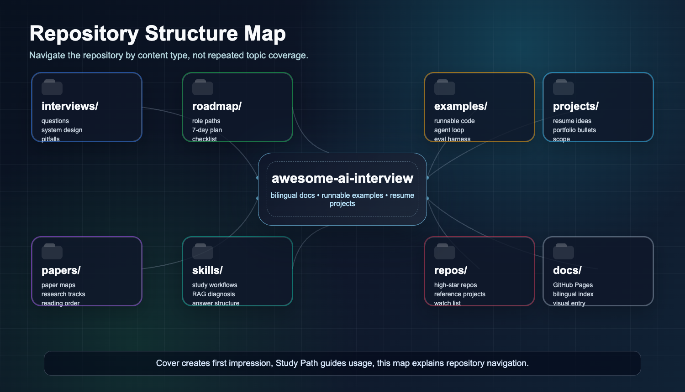
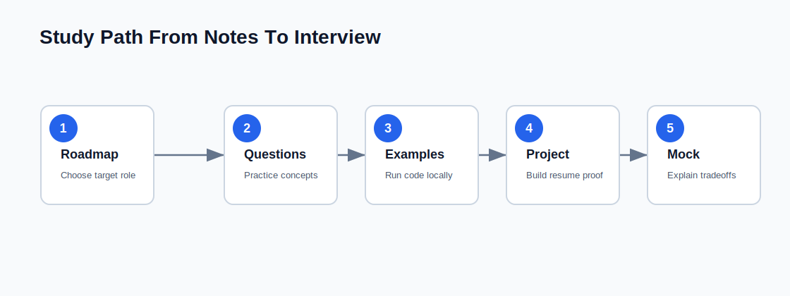

# Awesome AI Interview

English | [中文](zh-CN/)

A bilingual handbook for LLM, RAG, AI Agent interviews, skills, papers, and resume-ready projects.

## Start

| Goal | Link |
| --- | --- |
| LLM interview prep | [100 LLM Interview Questions](../interviews/100-llm-interview-questions.md) |
| RAG interview prep | [50 RAG Interview Questions](../interviews/50-rag-interview-questions.md) |
| Agent interview prep | [50 AI Agent Interview Questions](../interviews/50-agent-interview-questions.md) |
| Multimodal interview prep | [30 Multimodal/VLM Interview Questions](../interviews/30-multimodal-vlm-interview-questions.md) |
| Study plan | [7-Day Study Plan](../roadmap/7-day-study-plan.md) |
| Checklist | [7-Day Checklist](../roadmap/7-day-checklist.md) |
| Common mistakes | [Common Pitfalls](../interviews/common-pitfalls.md) |
| Runnable code | [Examples](../examples/) |
| RAG implementation | [RAG Mini System](../examples/rag-mini-system/) |
| Model routing | [Model Router](../examples/model-router/) |
| RAG evaluation | [RAG Eval Set](../examples/rag-eval-set/) |
| Coding agent repair | [Coding Agent Mini](../examples/coding-agent-mini/) |
| Paper summaries | [Paper Summaries](../paper-summaries/README.md) |
| High-star repos | [Curated AI Repositories](../repos/curated-ai-repositories.md) |
| Next expansion | [Next Expansion Plan](../NEXT_STEPS.md) |

## Runnable Examples

- [Minimal Agent Framework](../examples/minimal-agent-framework/)
- [LLM Eval Harness](../examples/llm-eval-harness/)
- [RAG Mini System](../examples/rag-mini-system/)
- [Model Router](../examples/model-router/)
- [RAG Eval Set](../examples/rag-eval-set/)
- [Coding Agent Mini](../examples/coding-agent-mini/)

## Why This Repo Exists

Most AI interview preparation is fragmented. This repository connects fundamentals, system design, evaluation, agent workflows, research maps, and runnable projects so candidates can explain both concepts and engineering tradeoffs.
