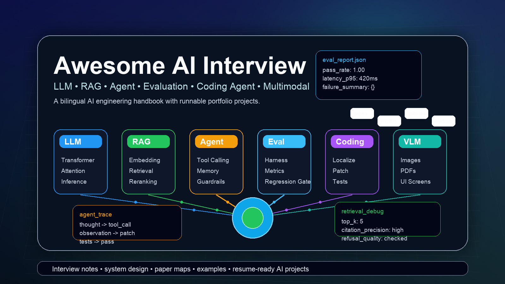
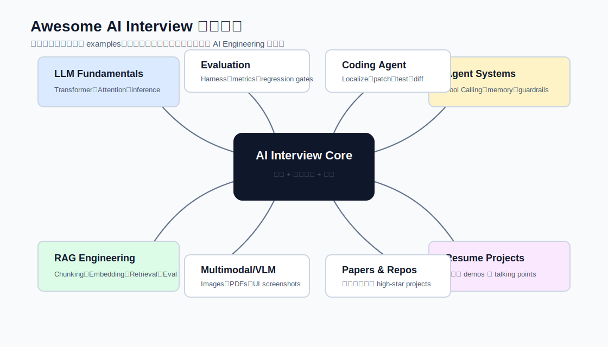
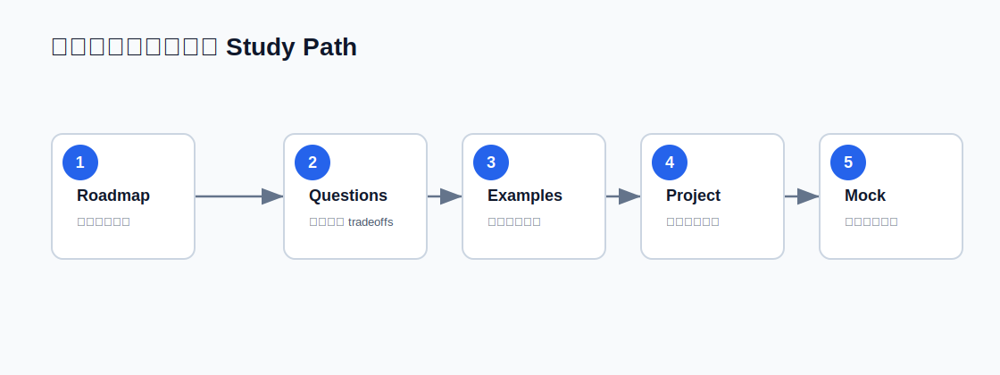

# Awesome AI Interview

[English](../) | 中文

面向 LLM、RAG、AI Agent 面试、skills、论文路线图和简历项目的中英文双语知识库。

## 快速开始

| 目标 | 链接 |
| --- | --- |
| 准备 LLM 面试 | [100 道 LLM 面试题](../../zh-CN/interviews/100-llm-interview-questions.md) |
| 准备 RAG 面试 | [50 道 RAG 面试题](../../zh-CN/interviews/50-rag-interview-questions.md) |
| 准备 Agent 面试 | [50 道 AI Agent 面试题](../../zh-CN/interviews/50-agent-interview-questions.md) |
| 准备多模态/VLM 面试 | [30 道 Multimodal/VLM 面试题](../../zh-CN/interviews/30-multimodal-vlm-interview-questions.md) |
| 学习路线 | [7 天学习路线](../../zh-CN/roadmap/7-day-study-plan.md) |
| 打卡清单 | [7 天打卡清单](../../zh-CN/roadmap/7-day-checklist.md) |
| 避开常见坑 | [AI 面试常见坑](../../zh-CN/interviews/common-pitfalls.md) |
| 可运行代码 | [Examples](../../zh-CN/examples/README.md) |
| RAG 实现 | [RAG Mini System](../../zh-CN/examples/rag-mini-system/README.md) |
| 模型路由 | [Model Router](../../zh-CN/examples/model-router/README.md) |
| RAG 评估 | [RAG Eval Set](../../zh-CN/examples/rag-eval-set/README.md) |
| Coding Agent 修复 | [Coding Agent Mini](../../zh-CN/examples/coding-agent-mini/README.md) |
| 论文摘要 | [论文摘要](../../zh-CN/paper-summaries/README.md) |
| 高 star 仓库 | [高 Star 高质量 AI 仓库汇总](../../zh-CN/repos/curated-ai-repositories.md) |
| 下一步扩充 | [下一步扩充计划](../../zh-CN/NEXT_STEPS.md) |

## 可运行 Examples

- [Minimal Agent Framework](../../zh-CN/examples/minimal-agent-framework/README.md)
- [LLM Eval Harness](../../zh-CN/examples/llm-eval-harness/README.md)
- [RAG Mini System](../../zh-CN/examples/rag-mini-system/README.md)
- [Model Router](../../zh-CN/examples/model-router/README.md)
- [RAG Eval Set](../../zh-CN/examples/rag-eval-set/README.md)
- [Coding Agent Mini](../../zh-CN/examples/coding-agent-mini/README.md)

## 为什么做这个仓库

大多数 AI 面试资料都比较碎。本仓库把基础原理、系统设计、评估、Agent workflow、论文路线图和可运行项目连起来，帮助候选人既能讲概念，也能讲工程 tradeoffs。
