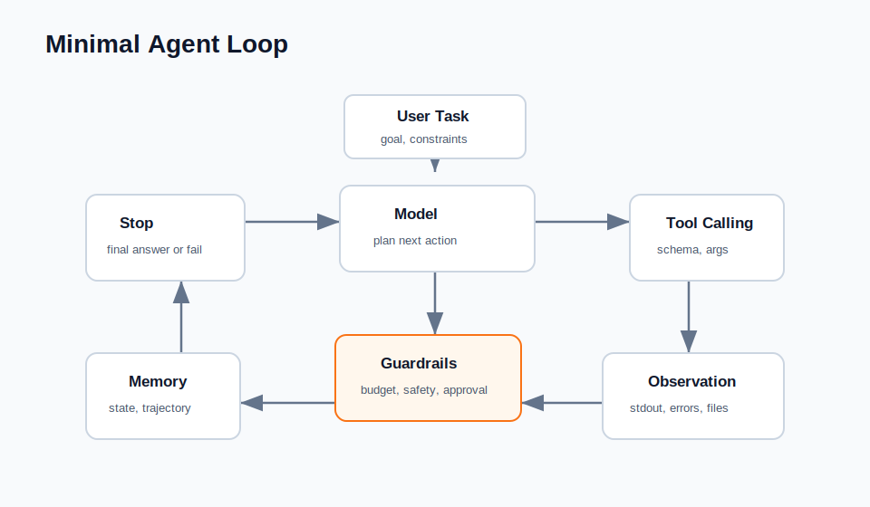

# Minimal Agent Framework Example

This example implements a tiny agent framework with no external dependencies.



It demonstrates:

- Explicit agent state.
- Tool registry.
- Tool schema validation.
- Model-tool-observation loop.
- Step budget.
- Trajectory logging.

## Architecture

See [ARCHITECTURE.md](ARCHITECTURE.md).

## Run

```bash
python3 examples/minimal-agent-framework/run_demo.py
```

## Files

- `agent.py`: agent state and execution loop.
- `models.py`: deterministic mock model that returns tool calls.
- `tools.py`: tool registry, schema validation, and example tools.
- `run_demo.py`: runnable demo.

## Interview Talking Points

- Agent frameworks are mostly control flow around model calls.
- Tool schemas are part of reliability.
- Explicit state makes long-running tasks debuggable.
- Step budgets and verification prevent runaway loops.
- Dangerous tools should require approval or dry-run mode.

## Test

```bash
python3 -m unittest discover examples/minimal-agent-framework/tests
```
