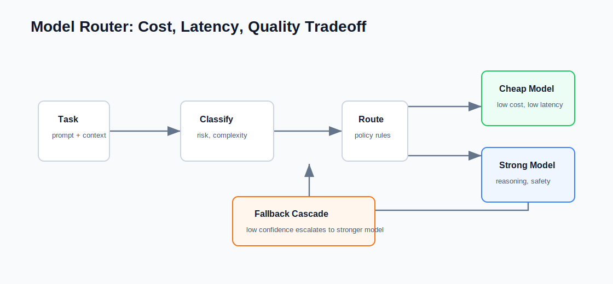

# Model Router

A dependency-free model routing demo that chooses between a cheap fast model and a stronger reasoning model.



It demonstrates:

- Task classification by risk and complexity.
- Small-model / large-model routing.
- Cost estimation.
- Latency estimation.
- Explainable routing decisions.
- Fallback/cascade from small model to large model when confidence is low.

## Run

```bash
python3 examples/model-router/run_demo.py
```

## Test

```bash
python3 -m unittest discover examples/model-router/tests
```

## Interview Talking Points

- Cost optimization is often a system design problem.
- Not every request needs the strongest model.
- High-risk tasks should route to stronger models or human review.
- Routing policies need evaluation because wrong routing can silently degrade quality.
- Model routers should expose reasons, cost, and latency.
- Cascades should expose route paths so silent quality degradation can be debugged.

## Fallback Policy

The demo starts simple tasks on the small model. If `small_model_confidence` is below `0.7`, the router escalates to the large model and records a route path such as:

```text
small-fast-model -> large-reasoning-model
```
