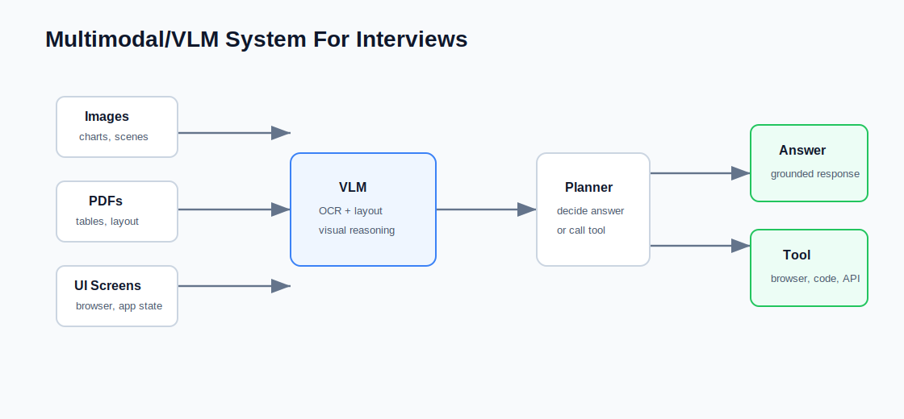

# 30 Multimodal And VLM Interview Questions

This page covers multimodal AI, vision-language models, document understanding, UI agents, and multimodal RAG.

## Foundations

### 1. What is a multimodal model?

Key points:

- A model that processes more than one modality such as text, image, audio, video, or structured UI state.
- It needs modality encoders and a shared representation space.
- Evaluation must be modality-specific.

### 2. What is a vision-language model?

Key points:

- A model that connects visual inputs with language understanding or generation.
- Common tasks include image captioning, visual question answering, OCR, chart understanding, and UI navigation.

### 3. How are images represented for language models?

Key points:

- Images can be converted into patches, visual tokens, region features, or embeddings.
- A projector or adapter maps visual representations into the language model space.

### 4. What is cross-modal alignment?

Key points:

- Aligning representations from different modalities so the model can connect visual evidence and text.
- Contrastive learning and instruction tuning are common approaches.

### 5. Why is multimodal evaluation hard?

Key points:

- Answers may require visual grounding, text reasoning, OCR, layout understanding, and common sense.
- Exact-match metrics miss many failure modes.

## Document Understanding

### 6. What makes document understanding different from image captioning?

Key points:

- Documents contain layout, tables, forms, small text, reading order, and metadata.
- Visual appearance and textual content both matter.

### 7. What is OCR-free document understanding?

Key points:

- The model directly consumes document images or layout-aware visual tokens.
- It can preserve layout but must still be evaluated on small text and tables.

### 8. When is OCR still useful?

Key points:

- OCR provides explicit text spans.
- It helps search, citation, highlighting, and deterministic extraction.
- OCR errors must be tracked.

### 9. How do you evaluate table understanding?

Key points:

- Check cell-level accuracy, header association, numerical reasoning, and row/column relationships.
- Visual layout and extracted text should both be tested.

### 10. How do you handle scanned PDFs?

Key points:

- Use OCR or multimodal parsing.
- Preserve page numbers and bounding boxes.
- Store source coordinates for citation.

## Multimodal RAG

### 11. What is multimodal RAG?

Key points:

- Retrieval and generation over text, images, charts, tables, screenshots, or PDFs.
- Requires modality-aware indexing and citation.

### 12. How do you retrieve images?

Key points:

- Use image embeddings, text captions, OCR text, metadata, or hybrid retrieval.
- Retrieval should return source image/page/region ids.

### 13. How do you cite visual evidence?

Key points:

- Cite document id, page number, image id, and bounding box when possible.
- The answer should not cite visual evidence that was not retrieved.

### 14. What are common multimodal RAG failures?

Key points:

- OCR errors.
- Wrong image-region retrieval.
- Chart misreading.
- Lost layout.
- Answer not grounded in visual evidence.

### 15. How do you evaluate multimodal RAG?

Key points:

- Retrieval recall by modality.
- OCR accuracy.
- Visual grounding.
- Citation correctness.
- Answer faithfulness.

## UI And Browser Agents

### 16. What is a UI agent?

Key points:

- An agent that observes a user interface and takes actions such as clicking, typing, scrolling, or reading UI state.
- It needs visual perception, action planning, and safety controls.

### 17. What makes UI agents difficult?

Key points:

- Dynamic pages.
- Hidden state.
- Ambiguous affordances.
- Untrusted web content.
- Risky side effects.

### 18. How should a UI agent observe a page?

Key points:

- Use screenshots, accessibility tree, DOM, OCR, or a combination.
- The best observation depends on the task and environment.

### 19. How do you make UI agents safe?

Key points:

- Require confirmation for purchases, messages, deletions, or external submissions.
- Use allowlisted domains and tools.
- Log actions and screenshots.

### 20. How do you evaluate UI agents?

Key points:

- Task success.
- Action correctness.
- Step count.
- Recovery from navigation errors.
- Safety violations.

## Engineering And System Design

### 21. How do you design a multimodal document QA system?

Key points:

- Parse PDFs into text, layout, images, tables, and metadata.
- Index text and visual regions.
- Retrieve relevant evidence.
- Generate cited answers.

### 22. How do you handle charts?

Key points:

- Extract chart type, axes, legends, values, and captions.
- Test numerical reasoning separately from visual identification.

### 23. How do you handle video understanding?

Key points:

- Sample frames.
- Extract audio transcript.
- Index temporal segments.
- Cite timestamps.

### 24. How do you reduce multimodal model cost?

Key points:

- Route simple OCR tasks to cheaper OCR pipelines.
- Use thumbnails or region crops.
- Cache embeddings and parsed outputs.
- Use text-only models after extraction when possible.

### 25. How do you debug a wrong visual answer?

Key points:

- Check whether the right image/page/region was retrieved.
- Check OCR and layout parsing.
- Check prompt and citation mapping.
- Add a regression case.

## Pitfalls

### 26. Why is "just use a VLM" often insufficient?

Key points:

- Production systems need parsing, retrieval, citations, permissions, evaluation, and monitoring.

### 27. What is visual hallucination?

Key points:

- The model describes objects, text, or relationships not present in the image.
- Mitigate with grounding, region references, and verification.

### 28. How do permissions work in multimodal systems?

Key points:

- Permissions apply to documents, pages, images, OCR text, and extracted metadata.
- Logs and thumbnails can leak sensitive data.

### 29. What should be logged?

Key points:

- Retrieved visual evidence ids.
- OCR output versions.
- Model inputs and outputs with redaction.
- User feedback and corrections.

### 30. What is a strong multimodal interview project?

Key points:

- A document QA system with OCR, layout-aware retrieval, citations, and evaluation.
- A UI agent with screenshots, action logs, and safety approvals.
- A chart QA benchmark with visual grounding checks.
