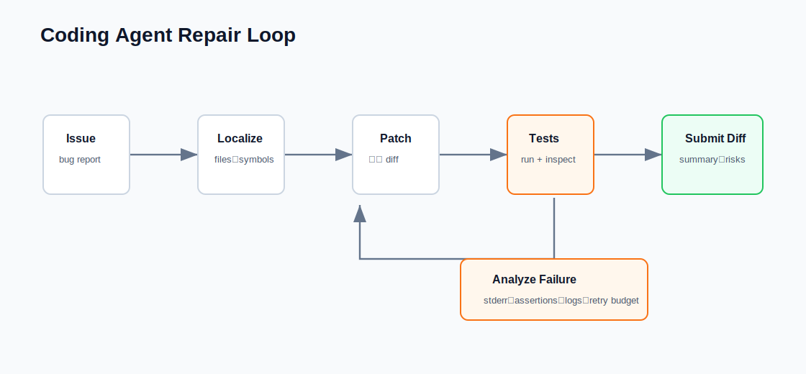

# Coding Agent Mini

一个轻量 coding agent demo，会在临时目录中修复 toy repository。



它展示：

- Issue parsing。
- Code localization。
- Patch generation。
- Unified diff summary。
- Test execution。
- Verified repair output。

## 运行

```bash
python3 examples/coding-agent-mini/run_demo.py
```

## 测试

```bash
python3 -m unittest discover examples/coding-agent-mini/tests
```

## 面试 talking points

- Coding agent 应先定位再编辑。
- Patch 应范围明确且可 review。
- Tests 是 coding agent 最强 verifier。
- Diff summary 和 test output 让 agent 可审计。
- 真实系统需要 sandboxing 和 permission controls。
