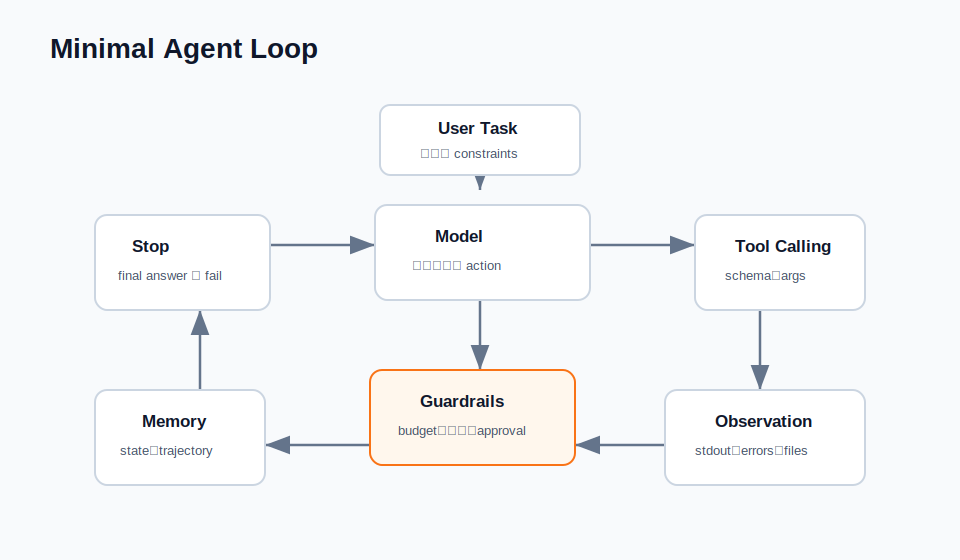

# Minimal Agent Framework Example

这个 example 实现了一个无外部依赖的 tiny agent framework。



它展示：

- 显式 agent state。
- Tool registry。
- Tool schema validation。
- Model-tool-observation loop。
- Step budget。
- Trajectory logging。

## 架构

见 [ARCHITECTURE.md](ARCHITECTURE.md)。

## 运行

```bash
python3 examples/minimal-agent-framework/run_demo.py
```

## 文件

- `agent.py`：agent state 和 execution loop。
- `models.py`：返回 tool calls 的 deterministic mock model。
- `tools.py`：tool registry、schema validation 和示例工具。
- `run_demo.py`：可运行 demo。

## 面试 talking points

- Agent framework 本质上是围绕模型调用的控制流。
- Tool schema 是可靠性的一部分。
- 显式 state 让长任务可 debug。
- Step budget 和 verification 可以防止 runaway loops。
- 危险工具应该需要 approval 或 dry-run mode。

## 测试

```bash
python3 -m unittest discover examples/minimal-agent-framework/tests
```

代码位于 [`examples/minimal-agent-framework`](../../../examples/minimal-agent-framework/)。
