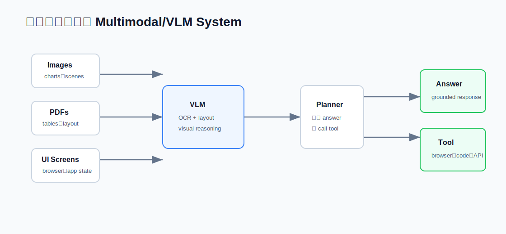

# 30 道 Multimodal 与 VLM 面试题

本页覆盖多模态 AI、视觉语言模型、文档理解、UI Agent 和 Multimodal RAG。

## 基础

### 1. 什么是多模态模型？

要点：

- 能处理 text、image、audio、video 或结构化 UI state 等多种模态的模型。
- 需要 modality encoders 和共享表示空间。
- Evaluation 必须按模态设计。

### 2. 什么是视觉语言模型？

要点：

- 连接视觉输入和语言理解/生成的模型。
- 常见任务包括 image captioning、visual question answering、OCR、chart understanding 和 UI navigation。

### 3. 图像如何表示给语言模型？

要点：

- 图像可转换为 patches、visual tokens、region features 或 embeddings。
- Projector 或 adapter 会把视觉表示映射到语言模型空间。

### 4. 什么是 cross-modal alignment？

要点：

- 对齐不同模态的表示，让模型能连接视觉证据和文本。
- Contrastive learning 和 instruction tuning 是常见方法。

### 5. 为什么 multimodal evaluation 很难？

要点：

- 答案可能需要 visual grounding、文本推理、OCR、layout understanding 和常识。
- Exact-match metrics 会漏掉很多失败模式。

## 文档理解

### 6. 文档理解和 image captioning 有什么不同？

要点：

- 文档包含 layout、tables、forms、小字、reading order 和 metadata。
- 视觉外观和文本内容都重要。

### 7. 什么是 OCR-free document understanding？

要点：

- 模型直接消费文档图片或 layout-aware visual tokens。
- 可保留布局，但仍需评估小字和表格。

### 8. 什么时候 OCR 仍然有用？

要点：

- OCR 提供显式 text spans。
- 有助于 search、citation、highlighting 和 deterministic extraction。
- OCR errors 必须追踪。

### 9. 如何评估 table understanding？

要点：

- 检查 cell-level accuracy、header association、numerical reasoning 和 row/column relationships。
- Visual layout 和 extracted text 都要测试。

### 10. 如何处理 scanned PDFs？

要点：

- 使用 OCR 或 multimodal parsing。
- 保留 page numbers 和 bounding boxes。
- 存储 source coordinates 以支持 citation。

## Multimodal RAG

### 11. 什么是 multimodal RAG？

要点：

- 面向 text、images、charts、tables、screenshots 或 PDFs 的 retrieval 和 generation。
- 需要 modality-aware indexing 和 citation。

### 12. 如何检索图片？

要点：

- 使用 image embeddings、text captions、OCR text、metadata 或 hybrid retrieval。
- Retrieval 应返回 source image/page/region ids。

### 13. 如何引用视觉证据？

要点：

- 尽量引用 document id、page number、image id 和 bounding box。
- 答案不应引用未检索到的视觉证据。

### 14. Multimodal RAG 常见失败有哪些？

要点：

- OCR errors。
- 错误 image-region retrieval。
- Chart misreading。
- Lost layout。
- 答案没有被视觉证据 grounding。

### 15. 如何评估 multimodal RAG？

要点：

- Retrieval recall by modality。
- OCR accuracy。
- Visual grounding。
- Citation correctness。
- Answer faithfulness。

## UI 与 Browser Agents

### 16. 什么是 UI Agent？

要点：

- 观察用户界面并执行点击、输入、滚动或读取 UI state 的 Agent。
- 需要 visual perception、action planning 和 safety controls。

### 17. UI Agent 难在哪里？

要点：

- Dynamic pages。
- Hidden state。
- Ambiguous affordances。
- Untrusted web content。
- Risky side effects。

### 18. UI Agent 应如何观察页面？

要点：

- 使用 screenshots、accessibility tree、DOM、OCR 或组合。
- 最佳 observation 取决于任务和环境。

### 19. 如何让 UI Agent 安全？

要点：

- 购买、发消息、删除或外部提交前要求确认。
- 使用 allowlisted domains 和 tools。
- 记录 actions 和 screenshots。

### 20. 如何评估 UI Agent？

要点：

- Task success。
- Action correctness。
- Step count。
- Recovery from navigation errors。
- Safety violations。

## 工程与系统设计

### 21. 如何设计 multimodal document QA 系统？

要点：

- 把 PDF 解析成 text、layout、images、tables 和 metadata。
- 索引文本和视觉区域。
- 检索相关证据。
- 生成带 citation 的答案。

### 22. 如何处理 charts？

要点：

- 提取 chart type、axes、legends、values 和 captions。
- 数值推理与视觉识别要分开测试。

### 23. 如何处理 video understanding？

要点：

- 采样 frames。
- 提取 audio transcript。
- 索引 temporal segments。
- 引用 timestamps。

### 24. 如何降低 multimodal model 成本？

要点：

- 简单 OCR 任务路由到更便宜 OCR pipeline。
- 使用 thumbnails 或 region crops。
- 缓存 embeddings 和 parsed outputs。
- 提取后尽量使用 text-only model。

### 25. 如何 debug 错误视觉答案？

要点：

- 检查是否检索到正确 image/page/region。
- 检查 OCR 和 layout parsing。
- 检查 prompt 和 citation mapping。
- 加 regression case。

## 常见坑

### 26. 为什么 “just use a VLM” 经常不够？

要点：

- 生产系统需要 parsing、retrieval、citations、permissions、evaluation 和 monitoring。

### 27. 什么是 visual hallucination？

要点：

- 模型描述了图像中不存在的物体、文字或关系。
- 可用 grounding、region references 和 verification 缓解。

### 28. 多模态系统如何处理权限？

要点：

- 权限作用于 documents、pages、images、OCR text 和 extracted metadata。
- Logs 和 thumbnails 也可能泄露敏感数据。

### 29. 应该记录什么日志？

要点：

- Retrieved visual evidence ids。
- OCR output versions。
- 经过脱敏的 model inputs 和 outputs。
- User feedback 和 corrections。

### 30. 什么是强 multimodal 面试项目？

要点：

- 带 OCR、layout-aware retrieval、citations 和 evaluation 的 document QA system。
- 带 screenshots、action logs 和 safety approvals 的 UI Agent。
- 带 visual grounding checks 的 chart QA benchmark。
